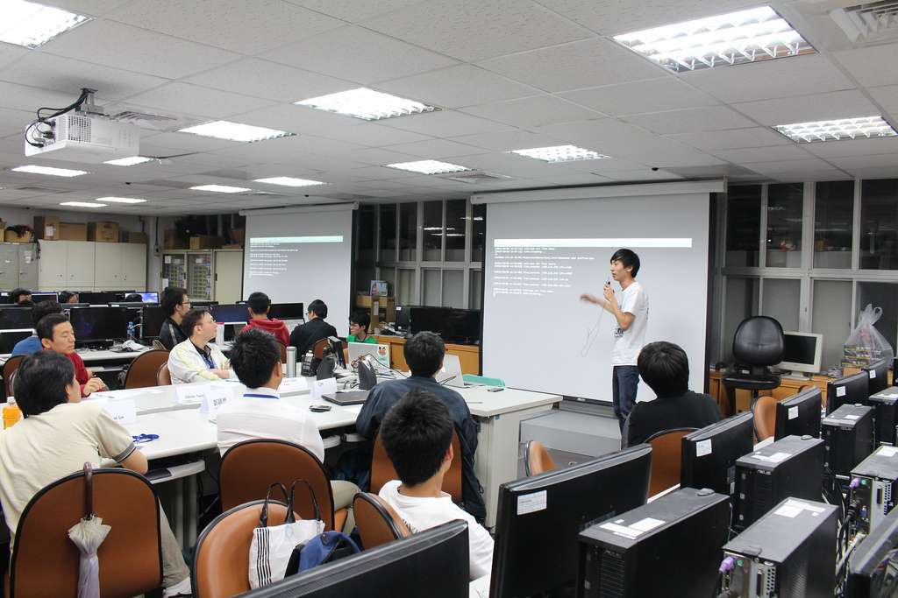
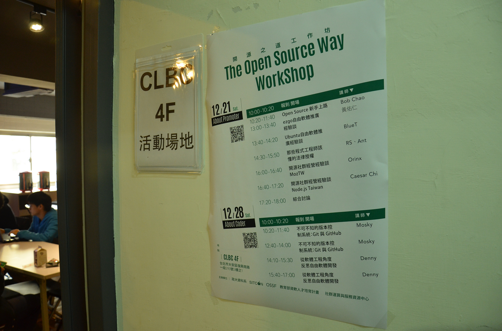
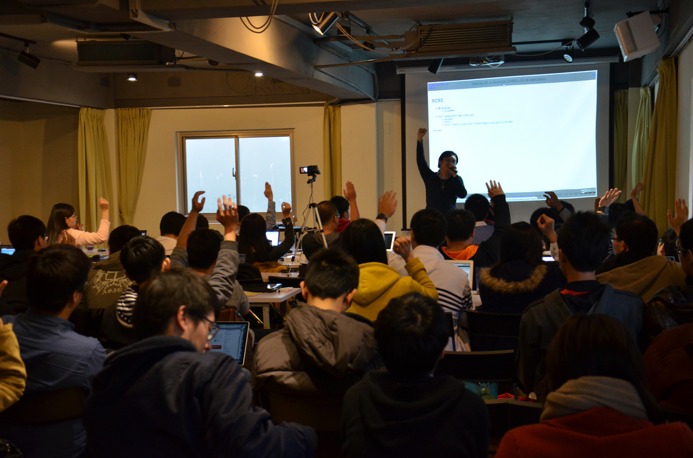
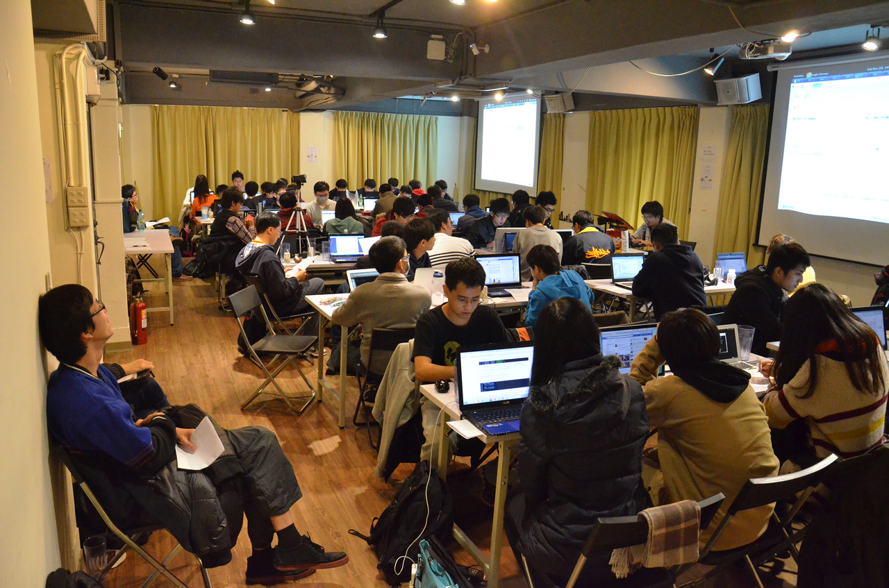
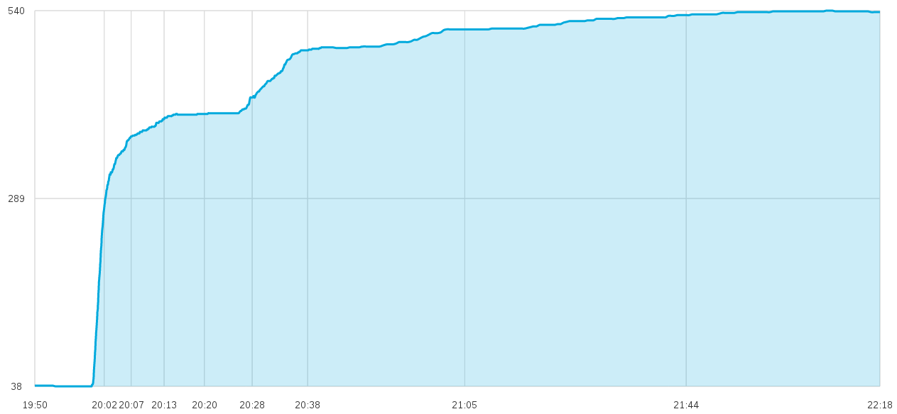
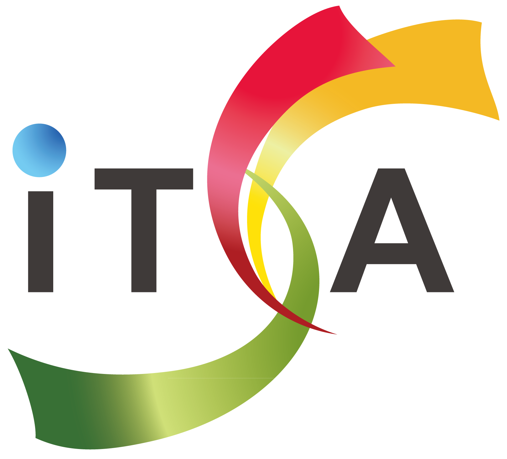
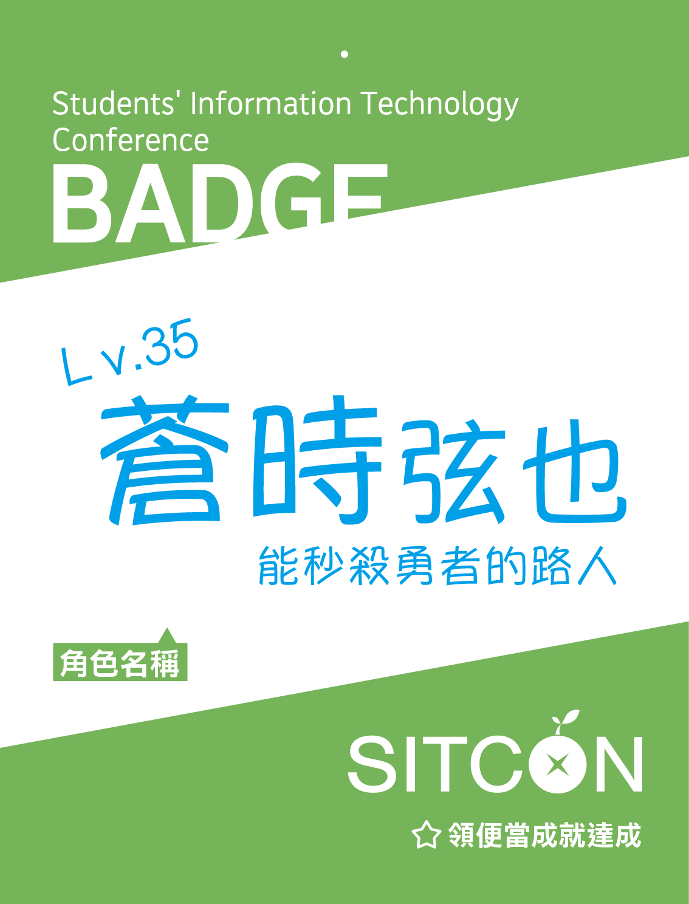

title: SITCON 2014 Opening
output: main.html
theme: jdan/cleaver-retro

--

	

		 
		 
		 
		<object data="./img/logo_white.svg" type="image/svg+xml" width="400">
		</object>
		 
		
			學生計算機年會 
		
		
			Students&#39; Information Technology Conference
		
		 
		 
		學生與創新實作
		 
		 
		 
		 
	

--

<h2 style="font-size: 48px">
	總召
</h2>
 

	Denny Huang

--

<h2 style="font-size: 48px">
	平凡的總召
</h2>
 

	Denny Huang

--
<h1 style="font-size: 60px">
	<a href="http://me.sitcon.org/">
	http://me.sitcon.org/
	</a>
</h1>

--

<h2 style="font-size: 70px">IRC</h2>

 
<li>
	<h2 style="font-size: 40px">#SITCON@irc.freenode.net</h2>
</li>
<li>
	<h2 style="font-size: 40px">
		<a herf="http://sitcon.org/webchat">
			http://sitcon.org/webchat
		</a>
	</h2>
</li>

--

 
<h2 style="font-size: 70px">
	座位表
	By Takeshi
</h2>

 
<h2 style="font-size: 40px">
	<a herf="http://seat.sitcon.org/">
		http://seat.sitcon.org/
	</a>
</h2>

--

# SITCON?

--

# 除了年會？

--

 

	
</img>
--

--

--

### Workshop

* HackGen Workshop - 歡迎來到 GitHub 新手村（政大場）
* HackGen Workshop - 歡迎來到 GitHub 新手村（大同場）
* SITCON Workshop @ NTUST: Titanium Mobile 進化攻防戰 - Alloy MVC
* The Open Source Way 開源之道工作坊 - Promoter
* The Open Source Way 開源之道工作坊 - Coder

--

--

--

--

### 取得最新消息

* Facebook 粉絲團 - SITCON 學生計算機年會<br/ >
https://www.facebook.com/SitconTW 
 
* Facebook 社團 - 學生計算機年會（SITCON）交流區 
https://www.facebook.com/groups/sitcon.tw/ 
 
* Mailing list (SITCON：日常- Google Groups) 
https://groups.google.com/d/forum/sitcon-general

--

### SITCON 2014

--

### 各校人數統計排名

<table width="400" align="center">
<tr align="center">
<th>排名</th>
<th>人數</th>
<th>學校名稱</th>
</tr>
<tr align="center">
<td>
	1
	</td>
	<td>61
	</td>
	<td>台灣科技大學</td>
	</tr>
	<tr align="center">
<td>
	2
	</td>
	<td>37
	</td>
	<td>元智大學</td>
	</tr>
	<tr align="center">
<td>
	3
	</td>
	<td>35
	</td>
	<td>交通大學</td>
	</tr>
	<tr align="center">
<td>
	4
	</td>
	<td>27
	</td>
	<td>台灣大學</td>
	</tr>
	<tr align="center">
<td>
	5
	</td>
	<td>21
	</td>
	<td>淡江大學</td>
	</tr>
	<tr align="center">
<td>
	6
	</td>
	<td>21
	</td>
	<td>大同大學</td>
	</tr>
	<tr align="center">
<td>
	7
	</td>
	<td>18
	</td>
	<td>中央大學</td>
	</tr>
	<tr align="center">
<td>
	8
	</td>
	<td>17
	</td>
	<td>中央大學</td>
	</tr>
	<tr align="center">
<td>
	9
	</td>
	<td>14
	</td>
	<td>輔仁大學</td>
	</tr>
	<tr align="center">
<td>
	10
	</td>
	<td>12
	</td>
	<td>東海大學</td>
	</tr>
</table>

--

### 主辦單位

 
 
<table width="800" align="center">
<tr align="center">
	<td>
		<object data="./img/logo_white.svg" type="image/svg+xml" width="300">
	</td>
	<td>
		
	</td>
</tr>
<tr align="center">
	<td>
		SITCON 學生計算機年會
	</td>
	<td>
		中研院 資創中心 自由軟體鑄造場
	</td>
</tr>
</table>

--

### 協辦單位

 

	 
	ITSA 教育部 資訊軟體人才培育計畫

--

### 贊助單位

 
特別感謝 - 華禎有限公司
<table width="800" align="center">
<tr align="center">
	<td>
		
	</td>
	<td>
		
	</td>
	<td>
		
	</td>
</tr>
<tr align="center">
	<td>
		祐生研究基金會
	</td>
	<td>
		KKTIX 售票亭
	</td>
	<td>
		justfont 就是字
	</td>
</tr>
</table>

--

# 議程

--

### Keynote

* 鄭永斌 教授 
台灣資訊工程教育的沉痾，創新，與改革

* 陳鍾誠 教授 
程式人的寫作與出版 -- 關於「程式人雜誌」的一些經驗分享

--

# Talk / Short Talk

--

### 座談會 - 學生與實作能力
* Richard Lee
* 陳鍾誠 教授
* 鄭永斌 教授
* 郭耀煌 教授
* 林旅強 (Richard Lin)
* jserv

--

# 主題沙龍

--

# Lightning Talk

--

# Lightning Talk

 
## 10:00 在白板區開放報名

--

### 注意事項

* 手機關機或調為振動

--

### 注意事項

* 手機關機或調為振動
* 大會提供錄音錄影

--

### 注意事項

* 手機關機或調為振動
* 大會提供錄音錄影
* 發問用現場麥克風

--

### 注意事項

* 手機關機或調為振動
* 大會提供錄音錄影
* 發問用現場麥克風
* 會議廳內禁止飲食

--

### 注意事項

* 手機關機或調為振動
* 大會提供錄音錄影
* 發問用現場麥克風
* 會議廳內禁止飲食
* 進出會議室請配戴識別證

--

	

--

### 注意事項

* 手機關機或調為振動
* 大會提供錄音錄影
* 發問用現場麥克風
* 會議廳內禁止飲食
* 進出會議室請配戴識別證
* 請勿以物品佔用座位

--

### 注意事項

* 手機關機或調為振動
* 大會提供錄音錄影
* 發問用現場麥克風
* 會議廳內禁止飲食
* 進出會議室請配戴識別證
* 請勿以物品佔用座位
* 遺失物請找詢問台

--

### 注意事項

* 手機關機或調為振動
* 大會提供錄音錄影
* 發問用現場麥克風
* 會議廳內禁止飲食
* 進出會議室請配戴識別證
* 請勿以物品佔用座位
* 遺失物請找詢問台
* 遵守場地指示

--

### 注意事項

* 手機關機或調為振動
* 大會提供錄音錄影
* 發問用現場麥克風
* 會議廳內禁止飲食
* 進出會議室請配戴識別證
* 請勿以物品佔用座位
* 遺失物請找詢問台
* 遵守場地指示
* 用餐桌椅不足 分兩次領餐

--

### 注意事項

* 手機關機或調為振動
* 大會提供錄音錄影
* 發問用現場麥克風
* 會議廳內禁止飲食
* 進出會議室請配戴識別證
* 請勿以物品佔用座位
* 遺失物請找詢問台
* 遵守場地指示
* 用餐桌椅不足 分兩次領餐
* 請節省使用免洗杯 重複使用

--

# 注意事項 - 
<h2 style="font-size: 60px">
	About Network
</h2>

--

 
 
 
<h2 style="font-size: 48px">
	請勿自行架設無線網路基地台
</h2>

--

<h2 style="font-size: 42px">

 
 
	SITCON / HITCON 只差一字 
 
	請不要看錯 嚴禁任何類型的網路攻擊
</h2>

--

# 好好享受精彩的一天吧！
